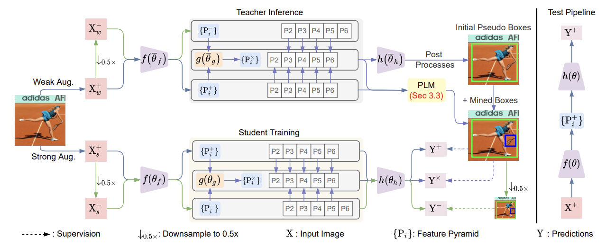

# MixTeacher: Mining Promising Labels with Mixed Scale Teacher for Semi-supervised Object Detection

This is the PyTorch implementation of our paper: 

[[Paper](https://arxiv.org/abs/2303.09061)] **MixTeacher: Mining Promising Labels with Mixed Scale Teacher for Semi-supervised Object Detection** 

Liang Liu, Boshen Zhang, Jiangning Zhang, Wuhao Zhang, Zhenye Gan, Guanzhong Tian, Wenbing Zhu, Yabiao Wang, Chengjie Wang

The IEEE / CVF Computer Vision and Pattern Recognition Conference (CVPR), 2023

\* The code will be available after the completion of the Tencent open-source review process.

